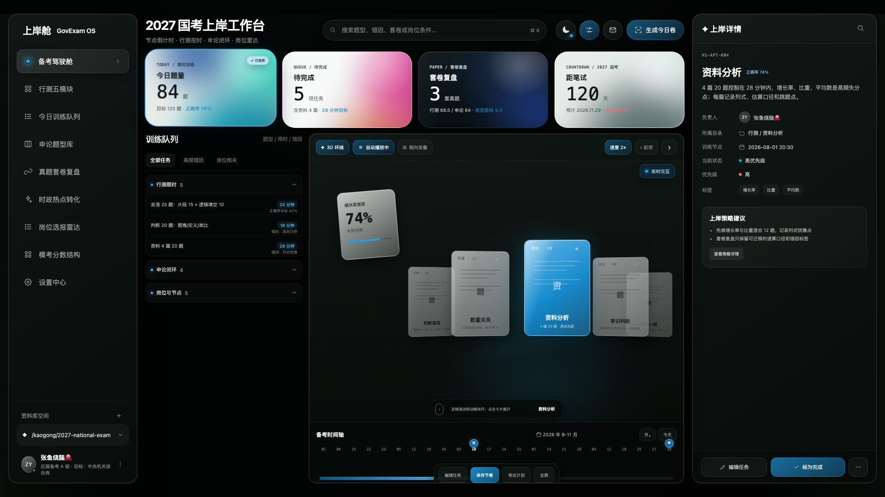
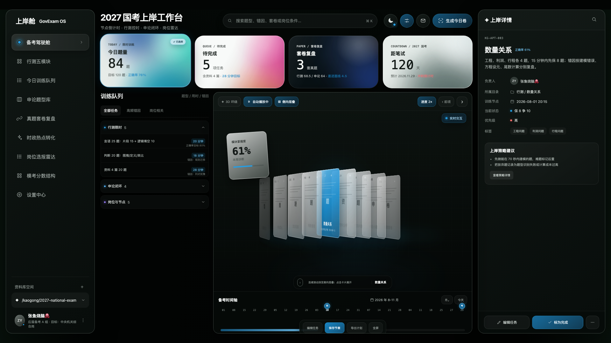
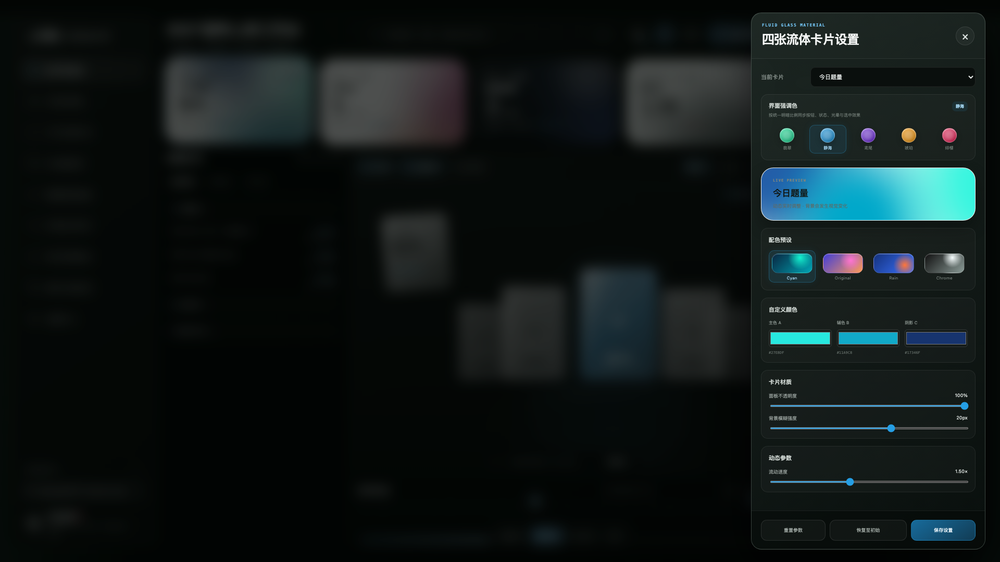

# Octopus Kaogong Workbench

**张鱼烧脑🐙** 出品的专业考公学习工作台视觉交互模板。项目面向国考、省考备考场景，把考试节点、行测训练、申论复盘、套卷错题、时政转化与岗位筛选集中到一个可直接打开的静态网页中，适合用作个人工作台原型、课程产品 Demo、学习系统首页或二次定制的交互样板。



## 核心定位

这是一个**零依赖静态网页模板**，不绑定账号系统、后端服务或特定框架。当前代码聚焦视觉层、信息架构与高保真交互表达，默认使用暗色主题与“静海”强调色，同时保留亮色、暗色、跟随系统和五套强调色的运行时切换能力。

模板适合承载以下考公业务结构：

- **国考 / 省考节点**：公告、职位表、报名、缴费、准考证、笔试、资格复审、面试等阶段可落在时间轴和任务队列中。
- **行测五模块**：言语理解、判断推理、数量关系、资料分析、常识判断分别以限时训练、正确率、错因、二刷节奏组织。
- **申论闭环**：归纳概括、综合分析、提出对策、贯彻执行、大作文可以按材料提取、采分点压缩、重写、批改、模板沉淀形成闭环。
- **套卷错题**：国考真题、省考联考、模考套卷可记录分模块耗时、题号、错因、二刷日期与进面线差距。
- **时政转化**：热点材料可转为常识判断背景、申论素材、作文论证与面试表达。
- **岗位雷达 / 进面线**：职位表字段、招录数、报考比、学历、专业、政治面貌、基层年限、最低服务期、体检限制、历年进面线与安全线可统一呈现。

## 界面结构

- **左侧导航**：备考驾驶舱、行测五模块、训练队列、申论题型库、真题套卷复盘、时政热点转化、岗位选报雷达、模考分数结构与设置中心。
- **顶部操作区**：搜索入口、主题切换、材质设置、消息与生成今日卷按钮。
- **概览卡片**：今日题量、待完成任务、套卷复盘、笔试倒计时四张流体卡片，用于承载高频状态指标。
- **训练队列**：按“行测限时”“申论闭环”“岗位与节点”分组，可展开查看题型、用时、错因与阶段事项。
- **中央演示区**：3D 环绕和侧向层叠两种卡片视图，支持滚轮、拖拽、点击、键盘与自动播放。
- **时间轴**：以 8-11 月为示例承载国考公告、报名、准考证、笔试等节奏点。
- **右侧详情**：展示当前模块的编号、状态、目录、训练节点、优先级、标签和策略建议。
- **设置抽屉**：集中管理强调色、流体卡片材质、自定义颜色、透明度、模糊和流速。



## 交互设计语言

模板采用“沉浸式学习驾驶舱”语言：主体信息密度高，操作区克制，动态效果用于表达学习模块的流转关系，而不是装饰性堆叠。

- **3D 环绕**：适合展示不同训练模块之间的循环节奏，自动播放可模拟每日滚动训练。
- **侧向层叠**：适合快速扫读多个模块，突出当前卡片并保留前后上下文。
- **平滑滚轮**：滚动输入会转为连续位置变化，避免一格一格的突兀跳动。
- **拖拽切换**：横向拖拽卡片区域可快速切换模块，释放后自动吸附到最近卡片。
- **自动播放**：默认开启，尊重 `prefers-reduced-motion`，在用户降低动态效果时停止自动推进。
- **设置抽屉**：从右侧滑入，背景弱化，便于在不离开工作台的情况下调色和调材质。

## 色彩与主题

默认首屏为：

- **显示主题**：暗色
- **强调色**：静海
- **作者 / 身份标识**：张鱼烧脑🐙，头像缩写 `ZY`

核心色彩 token 位于 `styles.css` 的 `:root` 和 `html[data-accent="..."]`：

- `--bg`：页面底色
- `--panel` / `--panel-2` / `--panel-soft`：面板层级
- `--line` / `--line-bright`：边线层级
- `--text` / `--muted`：正文和弱化文字
- `--accent-h` / `--accent-s` / `--accent-rgb`：强调色基础
- `--accent-50` 到 `--accent-900`：强调色明暗阶
- `--accent-foreground` / `--accent-ink`：强调色前景文本

内置五套强调色：

- **翡翠**：高活性训练状态，适合绿色增长感。
- **静海**：默认方案，冷静、清晰，适合长期备考工作台。
- **鸢尾**：偏理性和科技感，适合数据分析型界面。
- **琥珀**：适合冲刺、提醒、节点压迫感更强的版本。
- **绯樱**：适合更轻量、偏内容产品的视觉方向。

亮暗管理由内联启动脚本先写入 `data-theme`、`data-theme-resolved` 和 `data-accent`，再加载 CSS，减少首屏从默认色跳到持久化设置的闪烁。用户后续切换会写入 `localStorage`：

- `kaogong-workbench-theme`
- `kaogong-workbench-accent`

## 流体卡片与材质

四张概览卡使用 CSS 渐变场模拟流体材质，不依赖图片资源。设置抽屉支持：

- **材质预设**：Cyan、Original、Rain、Chrome
- **自定义颜色**：主色 A、辅色 B、阴影 C
- **透明度**：控制流体场参与程度
- **背景模糊**：控制材质扩散和玻璃感
- **流动速度**：控制渐变场漂移动画速度

默认四张指标卡按顺序使用固定材质：今日题量为 Cyan，待完成为 Original，套卷复盘为 Rain，距笔试为 Chrome。每张卡的透明度、模糊和流速可单独调节，恢复初始会从卡片自身的 `data-material`、`data-color-*`、`data-opacity`、`data-blur` 和 `data-flow` 读取。



### 调参技巧

- 想要更稳重的备考后台感：降低流速，提高模糊，选静海或翡翠。
- 想要更强的课程展示感：提高透明度，使用 Rain 或 Original。
- 想要卡片更像玻璃面板：使用 Chrome，并把模糊设在 18-24px。
- 想要降低视觉负担：切到亮色主题，降低流速，减少高饱和自定义色。

## 运行方式

项目不需要安装依赖。可直接打开 `index.html`，也可以使用内置静态服务器：

```bash
npm start
```

检查代码：

```bash
npm run check
```

`npm run check` 会执行 JavaScript 语法检查，并调用 `server.mjs --check` 验证静态资源文件存在。

## 目录结构

```text
kaogong-workbench/
├── index.html          # 页面结构、首屏主题启动脚本、SVG 图标与静态初始内容
├── styles.css          # 主题 token、布局、3D 卡片、流体材质、亮暗模式和响应式约束
├── app.js              # 数据样例、交互绑定、轮播、主题、强调色和材质设置逻辑
├── server.mjs          # 本地静态服务器和资源检查脚本
├── package.json        # npm 脚本，无第三方依赖
├── screenshots/        # README 截图目录
├── LICENSE             # MIT License
└── README.md
```

## 定制指南

- **替换备考数据**：修改 `app.js` 顶部的 `documents` 和 `groups`，可接入国考、省考、事业单位、选调生等不同题库结构。
- **调整考试节点**：修改 `renderTimeline()` 中的日期数组与节点标记，把公告、报名、缴费、准考证、笔试、面试等阶段映射到时间轴。
- **扩展岗位雷达**：在岗位卡片中加入职位代码、地区、单位、招录人数、专业限制、报考比、历年进面线和备注。
- **改品牌信息**：页面身份展示统一使用 `张鱼烧脑🐙` 与 `ZY`，如需二次发布，应同时检查侧栏、详情负责人和 README。
- **新增强调色**：在 `styles.css` 添加 `html[data-accent="name"]` token，并在 `index.html` 的强调色按钮区加入对应选项。
- **接入真实数据**：保留当前 DOM 结构，把 `documents` 和 `groups` 换成构建时生成的数据或本地 JSON 读取逻辑即可。

## 可访问性与性能

- 卡片、导航、队列和设置项使用按钮或可聚焦元素，支持键盘操作。
- 轮播区域支持方向键切换，空格控制自动播放。
- 主题和强调色按钮同步 `aria-label`、`aria-pressed` 与可见状态。
- 动效遵守 `prefers-reduced-motion`，用户偏好减少动态时会禁用连续动画和自动播放。
- 纯静态资源，无第三方运行时依赖，适合部署到任意静态托管服务。
- CSS 动画集中使用 transform、opacity、filter 和自定义属性，避免频繁布局抖动。

## License

MIT License. Copyright 2026 张鱼烧脑🐙.
