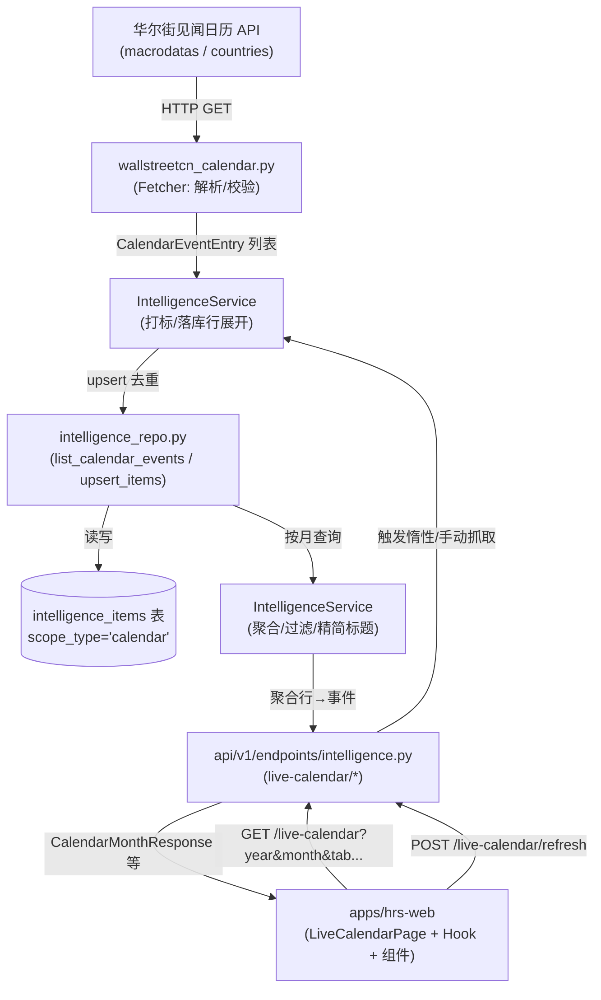
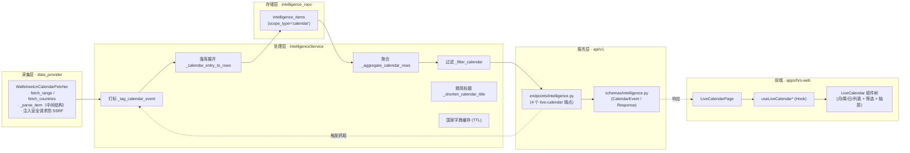

# 消息日历（Live Calendar）设计方案

> 目标：将华尔街见闻 `https://wallstreetcn.com/calendar` 的财经日历能力搬入 HermesX，提供「宏观 / 财报 / 新股 / 活动 分类 Tab + 月 / 周 / 日 / 列表视图 + 按天标注事件」的日历板块。
>
> 路由：`/live-calendar`；页面组件：`pages/LiveCalendarPage`。
>
> 本文为**方案文档**，同时与当前实现保持一致：所有接口契约、字段映射、分类规则均对应已落地的代码，改动实现须同步更新本文。

***

## 目录

- [1. 背景与目标](#1-背景与目标)
- [2. 数据源与接口契约](#2-数据源与接口契约)
- [3. 系统架构与分层](#3-系统架构与分层)
- [4. 分类 Tab 与打标规则](#4-分类-tab-与打标规则)
- [5. 重要度统一量纲](#5-重要度统一量纲)
- [6. 数据库设计](#6-数据库设计)
- [7. 后端接口规格](#7-后端接口规格)
- [8. 落库与查询流程](#8-落库与查询流程)
- [9. 前端设计](#9-前端设计)
- [10. 时间维度与精简标题规则](#10-时间维度与精简标题规则)
- [11. 降级策略](#11-降级策略)
- [12. 边界条件与空态](#12-边界条件与空态)
- [13. 配置项](#13-配置项)
- [14. 风险、合规与回滚](#14-风险合规与回滚)
- [15. 命名规范](#15-命名规范)
- [16. 测试与验证现状](#16-测试与验证现状)
- [17. 接口设计要点（统一）](#17-接口设计要点统一)
- [18. 核心实现代码（前后端）](#18-核心实现代码前后端)
- [附录 A. 文档信息与变更日志](#附录-a-文档信息与变更日志)

***

## 附录 A. 文档信息与变更日志

### A.1 文档信息

| 项 | 内容 |
| -- | -- |
| 文档名称 | 消息日历（Live Calendar）设计方案 |
| 作者 | HermesX 平台组 |
| 最近更新 | 2026-09-25 |
| 状态 | 已落地，与当前实现同步 |
| 适用范围 | 后端 `data_provider` / `src/services` / `src/repositories` / `api`；前端 `apps/hrs-web` |
| 维护约定 | 任何接口契约 / 分类规则 / 落库结构变更须同步更新本文对应章节 |

### A.2 变更日志

| 版本 | 日期 | 作者 | 变更摘要 |
| -- | -- | -- | -- |
| v1.0 | 2026-09-25 | HermesX 平台组 | 基于当前代码重写方案：固化数据源契约、系统架构、分类打标、重要度量纲、落库/聚合、后端接口（表格化出入参）、前端设计、降级策略；新增接口统一设计要点、前后端核心实现代码、条件筛选功能、文档信息与变更日志 |

***

## 1. 背景与目标

### 1.1 需求来源

参考华尔街见闻财经日历页 `https://wallstreetcn.com/calendar`，该页面具备：

- 顶部**月份切换**与**分类 Tab**（宏观 / 财报 / 新股 / 活动）、**国家筛选**、**重要性筛选**
- 内容区：**月历网格**，每个日期格内标注当天事件，事件带**重要级色阶**与**国旗标识**
- 详情层：单条事件可展开看前瞻解读、经济数据四值（实际 / 预测 / 前值 / 修订）

### 1.2 与 live-news 的关键差异

| 维度     | live-news（快讯）              | live-calendar（日历）               |
| ------ | ------------------------- | ------------------------------ |
| 时间语义   | 「已发生」，按发布时间倒序流             | 「将发生 / 已发生」，按**日期格子**聚合           |
| 组织方式   | 时间线列表，按天分组                 | 月历网格 + 周 / 日 / 列表视图，按天定位          |
| 刷新语义   | 30s 轮询追新                   | 按月低频拉取 + **手动刷新**（不轮询）             |
| 上游接口   | `/apiv1/content/lives`     | `/apiv1/finance/macrodatas`    |
| 上游分类   | `channels`（8 频道）            | `calendar_type`（`FE` / `FD`）+ 服务端关键字打标   |

### 1.3 复用基础与当前实现状态

| 能力       | 位置                                       | 状态                          |
| -------- | ---------------------------------------- | --------------------------- |
| 日历抓取器    | `data_provider/wallstreetcn_calendar.py` | ✅ 已实现（HTTP + 解析，注入安全请求）       |
| 日历服务层    | `src/services/intelligence_service.py`    | ✅ 已实现（打标 / 落库 / 聚合 / 过滤 / 惰性拉取） |
| 日历仓储层    | `src/repositories/intelligence_repo.py`  | ✅ 已实现（复用 `intelligence_items`）    |
| 日历 API   | `api/v1/endpoints/intelligence.py`        | ✅ 已注册 `/api/v1/intelligence/live-calendar/*` |
| 日历 Schema | `api/v1/schemas/intelligence.py`          | ✅ 已实现                        |
| 前端路由     | `apps/hrs-web/src/router/manifest.ts`     | ✅ `live-calendar` 菜单项 + 懒加载页面     |
| 前端页面     | `apps/hrs-web/src/pages/LiveCalendarPage.tsx` | ✅ 已实现                    |
| 前端组件     | `apps/hrs-web/src/components/common/LiveCalendar/` | ✅ 已实现（基于 FullCalendar v6 封装）   |
| 前端 Hook  | `apps/hrs-web/src/hooks/useLiveCalendar.ts` | ✅ 已实现                    |

> **结论**：后端采集、落库、聚合、API 与前端页面 / 控件均已落地。方案重点在**接口契约、分类打标、重要度量纲、落库结构与降级策略**的固化，作为后续维护的权威依据。

***

## 2. 数据源与接口契约

### 2.1 数据源

- 主数据源：华尔街见闻财经日历接口，**基址** `https://api-one-wscn.awtmt.com`（与快讯域名 `api-one.wallstcn.com` 不同）。
- 抓取器：`WallstreetcnCalendarFetcher`，仅负责 HTTP 交互与原始响应解析，不含分类打标、落库、SSRF 校验（由服务层注入安全的 `request_get` 回调提供）。

### 2.2 可用接口

| #   | 接口                                                                       | 用途     | 状态                   |
| --- | ------------------------------------------------------------------------ | ------ | -------------------- |
| 1   | `GET {base}/apiv1/finance/countries`                                     | 国家字典   | ✅ 返回国家 / 币种 / 国旗        |
| 2   | `GET {base}/apiv1/finance/macrodatas?start=<ts>&end=<ts>`                | 日历事件主源 | ✅ 返回 `FE` + `FD` 事件集合    |

**请求头**（必需，缺失会返回非 `20000`）：

| Header       | 值                                   |
| ------------ | ----------------------------------- |
| `User-Agent` | 常规浏览器 UA（抓取器固定带 `hermesx-calendar` 标识） |
| `Referer`    | `https://wallstreetcn.com/calendar` |

**成功响应码**：`code == 20000`。非该值或 HTTP 非 200 一律由抓取器收敛为 `CalendarFetchError`。

**时间窗口**：`start` / `end` 为**秒级 UTC 时间戳**，闭区间。`macrodatas` 一次返回区间内全部事件（无分页游标），单月约 500~900 条。

### 2.3 macrodatas 返回字段全集

```json
{
  "code": 20000,
  "message": "OK",
  "data": {
    "items": [
      {
        "id": 15044,
        "public_date": 1788192000,
        "observation_date": "",
        "wscn_ticker": "",
        "country": "美国",
        "title": "美联储主席沃什在杰克逊霍尔年会首秀",
        "event": "",
        "country_id": "US",
        "quantity": "",
        "unit": "",
        "importance": 4,
        "mark": "",
        "push_status": false,
        "flag_uri": "https://wpimg-wscn.awtmt.com/<hash>.jpg",
        "calendar_key": "",
        "actual": "",
        "forecast": "",
        "previous": "",
        "revised": "",
        "period": "",
        "calendar_type": "FE",
        "subscribe_status": false,
        "uri": "",
        "assets": "",
        "foresight": "前瞻 | ……"
      }
    ]
  }
}
```

**字段语义与取值分布**

| 字段              | 类型      | 含义                                  | 取值 / 说明                                        |
| --------------- | ------- | ----------------------------------- | ---------------------------------------------- |
| `id`            | int     | 上游事件 ID                             | 稳定，作为落库去重键                                    |
| `public_date`   | int     | 事件时间（**秒级 UTC**）                     | `0` 表示全天事件（无具体时刻）                              |
| `calendar_type` | string  | `FE` 财经大事件 / `FD` 经济数据指标             | `FE` 偏事件叙述，`FD` 偏指标数值                          |
| `country` / `country_id` | string  | 国家中文名 / 代码                         | 多国 / 地区（US / CN / JP / DE / FR / GB / EU 等）         |
| `importance`    | int     | 重要级（**上游量纲**）                       | 取值集合 `{1,2,3,4}`，上限 4，不存在 5；缺失须归为业务量纲 `0`（无）    |
| `wscn_ticker`   | string  | 宏观指标代码                              | **仅 `FD` 有值**（如 `JP121749`），非个股代码；`FE` 恒空       |
| `title`         | string  | 事件标题（简短）                            | 日历格子主文案                                        |
| `foresight`     | string  | 前瞻解读（长文本）                           | 详情面板正文；`FD` 多为空                                |
| `flag_uri`      | string  | 国旗图 URL                              | 与 `countries` 接口一致                               |
| `actual` / `forecast` / `previous` / `revised` | string  | 实际值 / 预测值 / 前值 / 修订值                | **仅 `FD` 有值**，经济数据四件套                          |
| `uri`           | string  | 原文链接                                | `FE` 多为空                                        |

### 2.4 关键约束：分类 Tab 是服务端打标，不是上游字段

- 华尔街见闻的「宏观 / 财报 / 新股 / 活动」**不是上游返回的字段**，原页面由同一批数据 + 客户端过滤呈现。本项目由服务层对 `macrodatas` 的 `FE` 事件按标题 + 前瞻关键字打标（规则见 §4）。
- `reports` / `ipodatas` 端点虽存在，但对未登录态恒返回空，本期**不作为数据源依赖**，仅保留国家字典与 `macrodatas` 两个契约。

***

## 3. 系统架构与分层

```text
                  ┌─────────────────────────────────────────────┐
                  │  apps/hrs-web  (LiveCalendarPage + 组件树)    │
                  │  hooks/useLiveCalendar.ts  → api/liveCalendar.ts │
                  └───────────────┬─────────────────────────────┘
                                  │  /api/v1/intelligence/live-calendar/*
                  ┌───────────────┴─────────────────────────────┐
                  │  api/v1/endpoints/intelligence.py             │
                  │  api/v1/schemas/intelligence.py               │
                  └───────────────┬─────────────────────────────┘
                                  │
                  ┌───────────────┴─────────────────────────────┐
                  │  src/services/intelligence_service.py         │
                  │   · list_calendar_tabs / list_calendar_countries │
                  │   · refresh_calendar / list_calendar          │
                  │   · _tag_calendar_event / _calendar_entry_to_rows │
                  │   · _aggregate_calendar_rows / _filter_calendar   │
                  │   · _shorten_calendar_title                    │
                  └───────┬───────────────────────┬───────────────┘
                          │                       │
            ┌─────────────┴──────┐   ┌─────────────┴──────────────┐
            │ wallstreetcn_      │   │ src/repositories/            │
            │ calendar.py        │   │ intelligence_repo.py        │
            │ (fetcher)          │   │ · list_calendar_events       │
            │ 注入 _get_with_    │   │ · upsert_items (复用)         │
            │ validated_dns      │   └─────────────┬──────────────┘
            └─────────┬──────────┘                 │
                      │ HTTP                        │ intelligence_items
            ┌─────────┴──────────┐         ┌─────────┴──────────────┐
            │ 华尔街见闻 calendar │         │ SQLite / 关系库          │
            │ API (wscn)         │         │ scope_type='calendar'   │
            └────────────────────┘         └─────────────────────────┘
```

### 3.1 各层职责边界

- **`data_provider/wallstreetcn_calendar.py`**：仅做 HTTP 与解析，定义 `CalendarCountryEntry` / `CalendarEventEntry` 中间结构；不含分类、落库、降级、SSRF 校验。
- **`src/services/intelligence_service.py`（日历段落）**：打标规则、落库行展开、聚合去重、过滤、惰性抓取、精简标题、国家字典进程内缓存 TTL。
- **`src/repositories/intelligence_repo.py`**：`list_calendar_events` 按 `scope_type='calendar'` + 时间闭区间查询；写入复用 `upsert_items`。
- **`api/v1/endpoints/intelligence.py`**：路由编排，错误统一收敛为 500 `ErrorResponse`。

### 3.2 复用 intelligence_items 表

日历与快讯 / 通用资讯共用一张 `intelligence_items` 表，通过 `scope_type` 区分：

- 通用资讯：`scope_type` ∈ `symbol` / `market` / `sector`
- 实时快讯：`scope_type = 'channel'`
- **消息日历：`scope_type = 'calendar'`**

不新增表、不改唯一约束，与快讯「多频道各存一行」思路一致。

### 3.3 数据流向图



### 3.4 功能架构设计

按职责切分四个功能域，自上而下为「采集 → 处理 → 存储 → 服务」，前端独立消费：



- **解耦点**：Fetcher 不感知分类与落库；Service 不感知路由与前端；Repo 仅做读写；前端不感知上游字段风格（snake_case 已归一化为 camelCase）。
- **扩展位**：`source` 字段预留多数据源；`_CALENDAR_TABS` / `_CALENDAR_TAG_RULES` 为分类单一真源，新增分类只需改 Service 常量。

***

## 4. 分类 Tab 与打标规则

### 4.1 分类 Tab 定义（单一真源）

Tab 定义集中在 `IntelligenceService._CALENDAR_TABS`，API / 前端均以此为准：

| value      | label | order | 说明                |
| ---------- | ----- | ----- | ----------------- |
| `all`      | 全部    | 1     | 默认选中，展示全部事件        |
| `macro`    | 宏观    | 2     | 央行 / 利率 / 宏观指标等      |
| `earnings` | 财报    | 3     | 财报 / 业绩 / 电话会        |
| `ipo`      | 新股    | 4     | IPO / 上市 / 纳入指数      |
| `activity` | 活动    | 5     | 大会 / 峰会 / 论坛 / 发布会    |

### 4.2 打标规则

- 仅对 `FE` 事件打标；`FD` 事件不参与分类，单独归为 `economic_data`（见 §6）。
- 逐条按 `title + foresight` 关键字正则匹配，**可多归属**（一事件命中多分类则拆多行）。
- 顺序即优先级：先 `earnings` / `ipo` / `activity`，最后兜底 `macro`。

| 分类        | 命中关键字（正则）                                              |
| --------- | -------------------------------------------------------- |
| `earnings` | 财报\|季报\|中报\|年报\|半年报\|业绩\|业绩发布会\|电话会\|披露截止\|财务业绩              |
| `ipo`     | IPO\|上市\|招股\|询价\|申购\|挂牌\|纳入.{0,6}指数                       |
| `activity` | 大会\|峰会\|论坛\|发布会\|博览会\|数博会\|展会\|展览\|Connect\|发售\|上新\|开源        |
| `macro`   | 央行\|联储\|美联储\|议息\|利率决议\|褐皮书\|杰克逊霍尔\|CPI\|PMI\|GDP\|非农\|失业率\|通胀\|关税\|休市\|峰会\|国事访问\|公投\|外长\|元首\|理事会\|讲话\|货币政策 |

- `FE` 事件未命中任何关键字：落库 `scope_value='all'`，仅在「全部」Tab 兜底展示（特定分类 Tab 下隐藏）。

### 4.3 经济数据（FD）的处理

- `FD` 事件**不打标**，落库 `scope_value='economic_data'`，`tab_keys` 为空。
- 默认**不随分类展示**；当查询参数 `include_economic_data=true` 时，与 `FE` 事件一并返回，归在「宏观」口径下（前端默认开启该开关）。

***

## 5. 重要度统一量纲

### 5.1 设计原则

数据源只是数据提供方，重要度的业务定义归本项目。上游量纲（快讯 `score` 1~3、日历 `importance` 1~4、NewsNow 无字段）只在「归一化入口」出现一次，落库列 / API 输出 / 前端渲染统一使用**业务量纲 0~4**。

### 5.2 业务量纲映射（前后端共用）

| 业务量纲 | 含义    | 上游日历 `importance`                         |
| ---- | ----- | ---------------------------------------- |
| `0`  | 无     | 上游缺失 / 未提供（**不是「最低等级」**，不可兜底为 1）            |
| `1`  | 普通    | `1`                                      |
| `2`  | 较重要   | `2`                                      |
| `3`  | 重要    | `3`（同时是「重要」判定阈值 `IMPORTANT_THRESHOLD`）         |
| `4`  | 非常重要  | `4`                                      |

- 服务层落库前将上游 `importance` **钳制到 0~4**；缺失 → `0`（NONE），**不可兜底为 1**。
- 前端 `apps/hrs-web/src/constants/newsImportance.ts` 的 `ImportanceLevel` / `IMPORTANCE_LABELS` / `IMPORTANCE_COLORS` / `IMPORTANT_THRESHOLD` 与服务端常量一一对应，色阶随主题联动。

### 5.3 阈值

- 「重要」判定阈值 `IMPORTANT_THRESHOLD = 3`，与快讯 `wscn_live_news_important_score` 默认值对齐。

***

## 6. 数据库设计

### 6.1 复用表与区分维度

- 表：`intelligence_items`（不做结构改造）。
- 区分列：`scope_type = 'calendar'`。
- 分类列：`scope_value` 取分类短码之一：

| `calendar_type` | 命中分类                  | 落库 `scope_value`（可多行）          |
| --------------- | --------------------- | ----------------------------- |
| `FE`            | earnings / ipo / activity / macro | 各命中分类一行；未命中 → `all` 一行        |
| `FD`            | —                     | `economic_data`（单行）              |

### 6.2 去重键

复用 `upsert_items` 的去重键（对应表唯一约束）：

```text
(source_id 或 source_name, url, source_type, scope_type, scope_value, market)
```

- `source_id = NULL`
- `source_name = 'wallstreetcn-calendar'`
- `source_type = 'wscn_calendar'`
- `url = 'wscn-calendar/<id>'`（按上游 `id` 构造，便于反向解析）
- `scope_type = 'calendar'`
- `scope_value` = 分类短码
- `market` = 由国家代码映射（见 §6.4）

> 同一事件命中多分类 → 多行，因 `scope_value` 不同天然去重，不会重复。

### 6.3 raw_payload 契约

`raw_payload` 序列化保留溯源字段，供聚合层还原（不参与 API 输出）：

```json
{
  "id": 15044,
  "calendar_type": "FE",
  "tab_keys": ["earnings"],
  "country": "美国",
  "country_id": "US",
  "wscn_ticker": "",
  "actual": "", "forecast": "", "previous": "", "revised": "",
  "flag_uri": "https://...",
  "uri": "",
  "public_date": 1788192000,
  "importance": 4
}
```

### 6.4 其他落库字段

| 列             | 取值 / 来源                              |
| ------------- | ----------------------------------- |
| `title`       | 上游 `title`（兜底取 `foresight` 首行截断 300）   |
| `summary`     | 上游 `foresight`                       |
| `published_at` | 由 `public_date` 转 UTC `datetime`；`0`/缺失 → 退化为入库时间 |
| `fetched_at`  | 入库时间（保留期清理基准）                        |
| `importance`  | 归一化后的业务量纲 0~4                       |
| `market`      | 国家代码映射：`CN→cn` `HK→hk` `US→us` `JP→jp` `KR→kr` `TW→tw`，其余 `global` |

***

## 7. 后端接口规格

基础前缀：`/api/v1/intelligence/live-calendar`。响应统一 snake_case；前端 `api/liveCalendar.ts` 归一化为 camelCase。所有端点共用项目统一鉴权与错误模型（见 §17）。

### 7.0 接口总览

| # | 方法 | 路径 | 用途 | 触发抓取 | 响应模型 |
| -- | -- | -- | -- | -- | -- |
| 1 | GET | `/live-calendar/tabs` | 分类 Tab 列表（服务端常量） | 否 | `CalendarTabsResponse` |
| 2 | GET | `/live-calendar/countries` | 国家字典（含进程内缓存） | 否 | `CalendarCountriesResponse` |
| 3 | GET | `/live-calendar` | 按月查询事件（支持多维度过滤） | 惰性（缺失月） | `CalendarMonthResponse` |
| 4 | POST | `/live-calendar/refresh` | 手动触发指定月份抓取落库 | 是（逐月） | `CalendarRefreshResponse` |

### 7.1 GET /live-calendar/tabs

返回分类 Tab 列表（服务端常量 `_CALENDAR_TABS`，不依赖上游）。

**请求参数**：无。

**响应 `CalendarTabsResponse`**

| 字段 | 类型 | 必含 | 说明 |
| -- | -- | -- | -- |
| `tabs` | `array<CalendarTab>` | 是 | 分类 Tab 列表，元素见下表 |
| `degraded` | `boolean` | 是 | 降级标记（本接口恒为 `false`） |

`CalendarTab` 元素：

| 字段 | 类型 | 说明 |
| -- | -- | -- |
| `value` | `string` | 分类短码：`all` / `macro` / `earnings` / `ipo` / `activity` |
| `label` | `string` | 展示名（中文） |
| `order` | `int` | 排序权重，前端按升序排列 |

### 7.2 GET /live-calendar/countries

返回国家字典；上游失败时降级为空列表并置 `degraded=true`。进程内缓存 TTL（默认 86400s）。

**请求参数**：无。

**响应 `CalendarCountriesResponse`**

| 字段 | 类型 | 必含 | 说明 |
| -- | -- | -- | -- |
| `items` | `array<CalendarCountry>` | 是 | 国家字典，元素见下表 |
| `degraded` | `boolean` | 是 | 上游失败时置 `true`，`items` 退化为空 |

`CalendarCountry` 元素：

| 字段 | 类型 | 说明 |
| -- | -- | -- |
| `country_id` | `string` | 国家代码（≤2 位，如 `US`） |
| `country_name` | `string` | 国家中文名 |
| `currency` | `string` | 货币代码 |
| `currency_name` | `string` | 货币中文名 |
| `flag_uri` | `string` | 国旗图 URL |

### 7.3 GET /live-calendar

查询指定月份（UTC 口径）的日历事件，支持分类 / 国家 / 重要级 / 经济数据过滤。

**请求参数（Query）**

| 参数 | 类型 | 必填 | 取值 / 约束 | 说明 |
| -- | -- | -- | -- | -- |
| `year` | `int` | 是 | 2000~2100 | 年（UTC 口径） |
| `month` | `int` | 是 | 1~12 | 月（UTC 口径） |
| `tab` | `string` | 否 | `all` / `macro` / `earnings` / `ipo` / `activity` | 分类过滤；空或 `all` 等价全部 |
| `country_id` | `string` | 否 | ≤2 位 | 国家代码过滤（与 `tab` 取交集） |
| `importance_min` | `int` | 否 | 0~4 | 最低重要级（业务量纲，服务端过滤） |
| `include_economic_data` | `boolean` | 否 | 默认 `false` | 是否含 `FD` 经济数据；前端默认传 `true` |

**响应 `CalendarMonthResponse`**

| 字段 | 类型 | 必含 | 说明 |
| -- | -- | -- | -- |
| `items` | `array<CalendarEvent>` | 是 | 当月事件列表，元素见下表 |
| `total` | `int` | 是 | 当月事件总数（是否含 `FD` 取决于 `include_economic_data`） |
| `server_time` | `int` | 是 | 服务端当前秒级 UTC，前端兜底时钟 |
| `degraded` | `boolean` | 是 | 任意覆盖月份降级置 `true` |
| `source` | `string` | 是 | 固定 `wallstreetcn` |

`CalendarEvent` 元素：

| 字段 | 类型 | 说明 |
| -- | -- | -- |
| `id` | `int` | 上游事件 ID |
| `key` | `string` | `wscn-calendar-<id>`，前端 React key |
| `start_at` | `int` | 事件时间，秒级 UTC |
| `title` | `string` | 完整标题 |
| `short_title` | `string` | 精简标题（日历格子主文案，规则见 §10） |
| `summary` | `string` | 前瞻解读 |
| `calendar_type` | `string` | `FE` / `FD` |
| `tab_keys` | `string[]` | 命中分类（可多归属）；`FD` 为空 |
| `importance` | `int` | 业务量纲 0~4 |
| `country` | `string` | 国家中文名 |
| `country_id` | `string` | 国家代码 |
| `flag_uri` | `string` | 国旗图 URL |
| `actual` | `string` | 经济数据实际值（`FD` 有值） |
| `forecast` | `string` | 经济数据预测值（`FD` 有值） |
| `previous` | `string` | 经济数据前值（`FD` 有值） |
| `is_all_day` | `boolean` | 上游 `public_date` 为 `0` |
| `source_uri` | `string` | 原文链接 |

### 7.4 POST /live-calendar/refresh

手动触发指定月份抓取并落库（逐月，单月失败不阻断其它月）。

**请求 `CalendarRefreshRequest`（body）**

| 字段 | 类型 | 必填 | 取值 / 约束 | 说明 |
| -- | -- | -- | -- | -- |
| `year` | `int` | 是 | 2000~2100 | 年 |
| `month` | `int` | 是 | 1~12 | 月 |

**响应 `CalendarRefreshResponse`**

| 字段 | 类型 | 必含 | 说明 |
| -- | -- | -- | -- |
| `fetched_count` | `int` | 是 | 本批抓取落库事件数 |
| `degraded` | `boolean` | 是 | 降级标记 |
| `errors` | `array<string>` | 是 | 逐月失败原因；空数组表示全部成功 |

- 能力关闭（`wallstreetcn_calendar_enabled=false`）时返回 `{fetched_count:0, degraded:true, errors:["calendar disabled"]}`。

***

## 8. 落库与查询流程

### 8.1 抓取落库（refresh_calendar）

1. 校验总开关 `_calendar_enabled()`。
2. 计算月份 UTC 闭区间（`_month_utc_range`：月初 `00:00:00` ~ 月末 `23:59:59`）。
3. 调用 `fetcher.fetch_range(start_ts, end_ts)`；失败 → 返回 `degraded=true`。
4. 每条事件经 `_calendar_entry_to_rows` 转行：按分类拆多行（`FD` 单独 `economic_data`），统一 `url='wscn-calendar/<id>'`、`source_name/source_type`、`market` 映射、重要度钳制。
5. `repo.upsert_items(rows)` 批量写入（去重键见 §6.2）。

### 8.2 查询聚合（list_calendar）

1. 校验总开关；计算月份 UTC 闭区间。
2. `repo.list_calendar_events(published_from, published_to)` 取该月全部 `calendar` 行（**不做分类去重**）。
3. **惰性抓取**：若库中该月无数据，先 `refresh_calendar` 一次（冷启动），再查一次；抓取降级则 `degraded=true`。
4. `_aggregate_calendar_rows`：按 `url` 分组，多行合并为一条，拼出 `tab_keys`（剔除 `economic_data`），还原 `start_at` / `is_all_day` / 经济数据四值。
5. `_filter_calendar`：按 `tab` / `country_id` / `importance_min` / `include_economic_data` 过滤。
6. 返回 `items` / `total` / `server_time` / `degraded` / `source`。

### 8.3 过滤优先级（服务端 + 客户端）

- **服务端过滤**（触发重新请求）：`include_economic_data`（决定是否拉取 FD）。
- **客户端过滤**（内存中，不重新请求）：`tab` / `country_id` / `importance_min` / `importance`（多选）/ `calendar_type`（FE/FD）/ `keyword`。前端整月数据已在内存，过滤不触发新请求（见 §9.3）。

***

## 9. 前端设计

### 9.1 路由与页面

- 路由 `/live-calendar`，归属一级菜单组 `news`（`router/manifest.ts`：`menuName=资讯`、`menuDescription=财经资讯与日历`、`menuType=group`、`menuVisible=true`），与 `live-news` 同属「资讯」分组。
- 本页节点（`router/manifest.ts`）：`menuId=live-calendar`、`menuPagePath=pages/LiveCalendarPage`、`level=1`、`auth=protected`。
- 页面 `pages/LiveCalendarPage.tsx` 布局：页头 + 降级提示条 + 抬升卡片（TabNav + 筛选面板 + 日历主体）+ 选中日详情面板（始终置于日历下方，多列网格）。

### 9.2 组件树

```text
LiveCalendarPage
├─ useLiveCalendarTabs        → Tab 列表（后端驱动，label 经 i18n）
├─ useLiveCalendarCountries   → 国家字典（含 degraded）
├─ useLiveCalendarMonths      → 多月合并 + 归格 + 客户端过滤
├─ TabNav (分类 Tab)          → 全部 / 宏观 / 财报 / 新股 / 活动
├─ LiveCalendarFilterPanel    → 筛选：重要度多选 / 类型(FE·FD) / 国家 / 关键词
├─ LiveCalendar (FullCalendar 封装)
│   ├─ 月 / 周 / 日 / 列表 四视图
│   ├─ LiveCalendarEventDrawer  → 点事件打开详情抽屉
│   └─ LiveCalendarListView     → 自绘列表视图（四列真表头）
└─ 选中日详情面板 (EventCard 列表)
```

### 9.3 数据获取与归格

- `useLiveCalendarMonths(months, options)`：可见范围覆盖的月份**并行拉取**后合并（视图可见范围可能跨月，如月视图含上/下月填充格、周视图跨月周次）。
- 时区处理：按**本地时区** `YYYY-MM-DD` 归格（`toDateKeyFromSeconds`），避免 `toISOString()` 的 UTC 错位；覆盖月份两端各外扩 1 天以兼容任意时区下本地可见日与 UTC 日期的偏移。
- 竞态防护：`AbortController` 在中止在途请求，避免乱序覆盖；`items=null` 区分「加载中」与「已加载失败」。
- 筛选不重新请求：`tab` / 国家 / 重要度 / 类型 / 关键词均在内存过滤；仅 `include_economic_data` 与可见月份范围变化触发重新请求。
- 同格排序：按重要级降序、时间升序，重要事件优先露出。

### 9.4 视图模式

基于 `FullCalendar` v6 封装，提供**月 / 周 / 日 / 列表**四视图：

- **月视图**：按天归格，最多 3 条 + `+N` 折叠；点事件 → 详情抽屉，点日期格 → 切入日视图定位当日。
- **周视图**：同时段（默认 60 分钟窗口）达阈值（默认 3 条）的消息归集成一张卡片，卡片内按（时间, 重要度）双层结构展示。
- **日视图**：时间轴逐条展示，同时间段事件纵向错开。
- **列表视图**：不走 FullCalendar 的 list 插件（其仅两列），由 `LiveCalendarListView` 自绘四列真表头。

### 9.5 详情与筛选

- 点单条事件 → `LiveCalendarEventDrawer` 展示标题、时间、重要度、国家（国旗 / 货币 / 国名）、前瞻解读、经济数据四值。
- 筛选维度（见 `LiveCalendarFilterState`）：`importance`（多选，0~4）、`calendar_type`（all / FE / FD）、`countryId`、`keyword`（匹配 title / shortTitle）。
- 空态优先级：分类无结果 > 筛选无结果 > 通用无事件。

### 9.6 类型与 API 层

- `types/liveCalendar.ts`：`CalendarTabValue` / `CalendarTabDef` / `CalendarCountryDef` / `LiveCalendarEventDef` / `LiveCalendarQueryDef`。
- `api/liveCalendar.ts`：`getLiveCalendarTabs` / `getLiveCalendarCountries` / `getLiveCalendarMonth` / `refreshLiveCalendar`，统一把后端 snake_case 归一化为 camelCase。

### 9.7 条件筛选功能

日历提供多维条件筛选，覆盖「分类 / 重要度 / 类型 / 国家 / 关键词」五类维度。其过滤位置与请求触发策略如下表：

| 维度 | 取值 | 过滤位置 | 是否触发新请求 | 说明 |
| -- | -- | -- | -- | -- |
| 分类 Tab | `all` / `macro` / `earnings` / `ipo` / `activity` | 服务端 + 客户端 | 否（客户端） | `tab` 变化在已加载整月数据上内存过滤；不重新拉取（见 §7.3） |
| 重要度 | 多选 `0~4` | 客户端（`importance` 集合） | 否 | `LiveCalendarFilterState.importance` 多选；前端按 `importance ∈ set` 过滤 |
| 类型 | `all` / `FE` / `FD` | 客户端（`calendar_type`） | 否 | `all` 不区分；`FD` 仅当 `include_economic_data=true` 已拉取时可见 |
| 国家 | 国家代码（`countryId`） | 服务端 + 客户端 | 否（客户端） | 服务端 `country_id` 已过滤；客户端再按 `countryId` 二次过滤 |
| 关键词 | 自由文本 | 客户端（`keyword`） | 否 | 匹配 `title` / `short_title`（大小写不敏感） |

筛选交互要点：

- **仅两类变化触发新请求**：`include_economic_data`（首次请求是否拉取 `FD`）与可见月份范围变化会重新调用 `GET /live-calendar`；其余维度均在内存过滤，降低请求量（见 §9.3）。
- **服务端与客户端对应**：服务端过滤由 `IntelligenceService._filter_calendar` 实现（见 §18.3）；客户端过滤在 `useLiveCalendarMonths` 的 `events` 记忆化中完成（见 §18.7）。
- **空态优先级**：分类无结果 > 筛选无结果 > 通用无事件（见 §12）。
- **UI 承载**：筛选面板 `LiveCalendarFilterPanel` 由 `LiveCalendarFilterState` 驱动，置于页头抬升卡片内（见 §9.2）；维度状态与分类 Tab 相互独立，可叠加生效。

***

## 10. 时间维度与精简标题规则

### 10.1 时间维度

- 上游 `public_date` 为**秒级 UTC**；落库 `published_at` 按 UTC 解析，`0` / 缺失 → 全天事件，退化为入库时间。
- 前端展示按**本地时区**归格与排版；`is_all_day=true` 时不显示具体时刻，仅显示「全天」。

### 10.2 精简标题（short_title）

由 `_shorten_calendar_title` 生成，规则：

1. 去除中文 / 英文括号内的补充说明：`（...）` / `(...)`。
2. 按常见分隔符 `、 / ： :` 取第一段。
3. 去除冗余后缀（将于 / 将 / 预计将 / 正式 / 即将 + 举行 / 生效 / 公布 / 发布 / 上市 / 发售 / 开会 / 召开）。
4. 截断至约 18 个中文字符（英文按 0.5 折算），超出加 `…`。

> 精简标题仅用于日历格子主文案；完整标题与前瞻解读在详情抽屉展示。

***

## 11. 降级策略

| 故障点                 | 行为                                       |
| ------------------- | ---------------------------------------- |
| 国家字典接口失败            | `list_calendar_countries` 返回空列表 + `degraded=true`；前端弱化国家展示（缺国旗 / 货币时仅名称） |
| 月份抓取失败              | `refresh_calendar` 返回 `degraded=true`；`list_calendar` 惰性抓取失败时仍返回已落库数据（若有），并置 `degraded=true` |
| 上游非 20000 / HTTP 非 200 | 抓取器抛 `CalendarFetchError`，由服务层收敛为降级而非崩溃          |
| 能力开关关闭              | 所有日历接口返回空且不抓取（`degraded=true`）               |
| 前端单月加载失败           | 保留上一帧数据，避免空屏；错误态由 `error` 承载               |

- 前端统一在页眉下方展示 `degraded` 提示条（「数据源暂不可用，当前展示本地缓存数据」）。

***

## 12. 边界条件与空态

- **跨月可见范围**：月视图含上 / 下月填充格、周视图跨月周次；前端按覆盖月份并行拉取合并，避免跨月日无数据。
- **全天事件**：`public_date=0` → `is_all_day=true`，归格退化为入库时间，展示「全天」。
- **FD 经济数据**：默认不在分类 Tab 展示，需 `include_economic_data=true`（前端默认开）。
- **FE 未命中分类**：落库 `scope_value='all'`，仅在「全部」Tab 兜底，特定分类 Tab 下隐藏。
- **空态优先级**：分类无结果 > 筛选无结果 > 通用无事件（前端 `emptyText` 三段式）。
- **多归属事件**：同一事件命中多分类 → 多行落库 → 聚合为一条、`tab_keys` 多值，在各命中 Tab 均可见。

***

## 13. 配置项

配置入口：`src/config.py` + 环境变量（`.env`）。

| 配置键                                    | 默认值                              | 说明                       |
| -------------------------------------- | -------------------------------- | ------------------------ |
| `WALLSTREETCN_CALENDAR_ENABLED`        | `true`                           | 日历能力总开关；关闭后返回空且不抓取         |
| `WALLSTREETCN_CALENDAR_BASE_URL`       | `https://api-one-wscn.awtmt.com` | 日历接口基址（与快讯域名不同）            |
| `WALLSTREETCN_CALENDAR_TIMEOUT`        | `8.0`                            | 单请求超时（秒，收敛 1~30）           |
| `WALLSTREETCN_CALENDAR_IMPORTANT_SCORE` | `3`                              | 「重要」阈值（与快讯量纲对齐）            |
| `CALENDAR_COUNTRIES_CACHE_TTL`         | `86400`                          | 国家字典进程内缓存时长（秒，0~86400）      |

> 新增 / 调整配置项须同步 `.env.example` 与相关文档。

***

## 14. 风险、合规与回滚

### 14.1 风险

- **上游接口稳定性**：华尔街见闻接口可能调整或限流；当前仅依赖 `countries` + `macrodatas` 两个契约，降级策略保证不崩溃。
- **分类打标误判**：关键字正则可能漏标 / 错标（如「纳入指数」归入 IPO）；属已知精度边界，不影响主流程。
- **时区错位**：UTC 与本地时区转换是主要风险点，已通过两端外扩 1 天 + 本地时区归格缓解。
- **SSRF**：抓取器不内置 DNS 校验，由服务层注入 `_get_with_validated_dns` 安全请求实现防 SSRF。
- **响应体积**：单月约 500~900 条，抓取器限制单响应体 ≤ 8MB，超出抛 `CalendarFetchError`。

### 14.2 合规

- 数据来源为华尔街见闻公开财经日历，仅做聚合展示，保留 `source` 标识与原文 `source_uri`；不修改、不伪造事件内容。
- 遵循项目 `AGENTS.md`：不写死密钥 / 账号 / 路径 / 端口；配置优先走环境变量。

### 14.3 回滚

- 配置层：将 `WALLSTREETCN_CALENDAR_ENABLED=false` 即可关闭日历能力，所有接口返回空且不抓取，无需代码回滚。
- 代码层：日历逻辑集中在 `data_provider/wallstreetcn_calendar.py` 与 `intelligence_service.py` 日历段落，复用现有 `intelligence_items` 表，回滚不影响快讯 / 通用资讯。
- 前端层：页面与组件独立，移除 `live-calendar` 菜单项即下线入口，不影响其它模块。

***

## 15. 命名规范

- 后端常量 / 方法：`_CALENDAR_*` / `list_calendar*` / `refresh_calendar` / `calendar_enabled`，集中在 `IntelligenceService`，单一真源。
- 落库 `scope_type='calendar'`，`scope_value` 取分类短码（`macro` / `earnings` / `ipo` / `activity` / `all` / `economic_data`）。
- 分类 Tab value 单一真源为 `_CALENDAR_TABS`，API / 前端 / i18n key 均引用同一组 value。
- 前端类型用 `Def` 后缀（可脱离组件的数据契约）；API 层统一把 snake_case 归一化为 camelCase，不泄漏后端字段风格。

***

## 16. 测试与验证现状

- 后端：日历抓取 / 打标 / 聚合 / API 尚未有独立 pytest 用例覆盖（当前 CI 未强制）。维护时建议补充：`_tag_calendar_event` 多归属、`_shorten_calendar_title` 截断、`_aggregate_calendar_rows` 合并、`list_calendar` 过滤与降级路径。
- 前端：`apps/hrs-web` 已具备 lint / build 校验；日历组件遵循 `.conventions/frontend` 命名与组件约定（React.ComponentProps 继承、cn 合并、业务属性解构）。
- 手动验证路径：启动后端后访问 `/docs` 的 `live-calendar` 接口，或前端 `/live-calendar` 页面，确认 Tab / 国家 / 月历 / 详情抽屉 / 筛选 / 手动刷新均可用，降级提示条在断网时生效。

***

> 本文档与 `data_provider/wallstreetcn_calendar.py`、`src/services/intelligence_service.py`（日历段落）、`src/repositories/intelligence_repo.py`、`api/v1/endpoints/intelligence.py`、`api/v1/schemas/intelligence.py` 及 `apps/hrs-web` 日历前端保持同步；任何契约变更须同步更新本章节。

***

## 17. 接口设计要点（统一）

本节汇总四个日历接口的统一设计决策，作为 §7 契约的补充依据。

- **挂载与鉴权**：四个端点挂在 `/api/v1/intelligence` 路由组下（`live-calendar` 前缀），沿用项目统一鉴权与错误模型；非预期异常统一收敛为 `500 → ErrorResponse`，不在接口层透出上游细节。
- **时区口径**：所有月份查询以 **UTC 月**为口径（`year` / `month` 对应 UTC 月）；`start_at` 返回**秒级 UTC**；前端按本地时区归格与排版，避免 UTC 错位。
- **过滤职责分离**：
  - 服务端过滤：`include_economic_data`（决定是否返回 `FD` 经济数据）、`tab`、`country_id`、`importance_min` 均在 `list_calendar` 内生效。
  - 客户端过滤：`tab` / 国家 / 重要度多选 / 类型 / 关键词在已加载整月数据后由前端内存过滤，**不触发新请求**，降低请求量。
- **`include_economic_data` 默认值差异（有意为之）**：API 侧 `Query` 默认 `false`（保守，避免默认拉取大量 `FD`）；前端 `useLiveCalendarMonths` 默认 `true`（用户默认看全部）。两端口径已对齐，文档与实现保持一致。
- **降级标记 `degraded`**：贯穿 `tabs` / `countries` / `month` / `refresh` 四类响应；任意覆盖月份降级时 `month.degraded=true`，前端据此弱化国家展示并提示「数据源暂不可用」。
- **`source` 常量**：固定 `"wallstreetcn"`，为多数据源扩展预留字段。
- **幂等与去重**：`refresh` 幂等，写入按 §6.2 去重键 `upsert`，重复刷新不重复落库。
- **分页策略**：按月整月返回（单月量级 500~900 条），不做游标分页；跨月可见范围由前端按覆盖月份并行拉取合并（见 §9.3）。

***

## 18. 核心实现代码（前后端）

> 以下为与 §2~§9 契约一一对应的**关键实现片段**（非整文件）。完整实现以源码为准。

### 18.1 抓取器 `data_provider/wallstreetcn_calendar.py`

仅负责 HTTP 与解析，定义 `CalendarEventEntry` 中间结构；不含分类 / 落库 / SSRF 校验。

```python
class WallstreetcnCalendarFetcher:
    _COUNTRIES_PATH = "/apiv1/finance/countries"
    _MACRODATAS_PATH = "/apiv1/finance/macrodatas"

    def fetch_range(self, start_ts: int, end_ts: int) -> List[CalendarEventEntry]:
        """拉取 [start_ts, end_ts]（秒级 UTC，含端点）区间内的日历事件。"""
        if start_ts < 0 or end_ts < start_ts:
            raise CalendarFetchError(f"invalid calendar time range: start={start_ts} end={end_ts}")
        url = f"{self.base_url}{self._MACRODATAS_PATH}?start={start_ts}&end={end_ts}"
        payload = self._fetch_json(url)
        data = payload.get("data")
        if not isinstance(data, dict):
            raise CalendarFetchError("invalid calendar response: missing data")
        raw_items = data.get("items")
        if not isinstance(raw_items, list):
            raise CalendarFetchError("invalid calendar response: missing items")
        events: List[CalendarEventEntry] = []
        for raw_item in raw_items:
            entry = self._parse_item(raw_item)
            if entry is not None:
                events.append(entry)
        return events

    @classmethod
    def _parse_item(cls, raw_item: Any) -> Optional[CalendarEventEntry]:
        """解析单条事件；缺 ID 或标题/前瞻均为空则丢弃。"""
        if not isinstance(raw_item, dict):
            return None
        item_id = cls._coerce_int(raw_item.get("id"))
        if item_id is None:
            return None
        title = cls._clean_text(str(raw_item.get("title") or ""))
        foresight = cls._clean_text(str(raw_item.get("foresight") or ""))
        if not title and not foresight:
            return None
        return CalendarEventEntry(
            item_id=int(item_id),
            public_date=cls._coerce_int(raw_item.get("public_date")),
            calendar_type=str(raw_item.get("calendar_type") or "").strip(),
            title=title,
            foresight=foresight,
            # importance 缺失保留 None，由服务层归一化为 0（无），不可兜底为 1
            importance=cls._coerce_int(raw_item.get("importance")),
            country=str(raw_item.get("country") or "").strip(),
            country_id=str(raw_item.get("country_id") or "").strip(),
            wscn_ticker=str(raw_item.get("wscn_ticker") or "").strip(),
            actual=str(raw_item.get("actual") or "").strip(),
            forecast=str(raw_item.get("forecast") or "").strip(),
            previous=str(raw_item.get("previous") or "").strip(),
            revised=str(raw_item.get("revised") or "").strip(),
            flag_uri=str(raw_item.get("flag_uri") or "").strip(),
            uri=str(raw_item.get("uri") or "").strip(),
            raw=dict(raw_item),
        )
```

### 18.2 服务层打标与落库 `src/services/intelligence_service.py`

分类 Tab 与打标规则（单一真源）：

```python
_CALENDAR_TABS: Tuple[Dict[str, Any], ...] = (
    {"value": "all", "label": "全部", "order": 1},
    {"value": "macro", "label": "宏观", "order": 2},
    {"value": "earnings", "label": "财报", "order": 3},
    {"value": "ipo", "label": "新股", "order": 4},
    {"value": "activity", "label": "活动", "order": 5},
)

_CALENDAR_TAG_RULES: Tuple[Tuple[str, "re.Pattern[str]"], ...] = (
    ("earnings", re.compile(r"财报|季报|中报|年报|半年报|业绩|业绩发布会|电话会|披露截止|财务业绩")),
    ("ipo", re.compile(r"IPO|上市|招股|询价|申购|挂牌|纳入.{0,6}指数")),
    ("activity", re.compile(r"大会|峰会|论坛|发布会|博览会|数博会|展会|展览|Connect|发售|上新|开源")),
    ("macro", re.compile(r"央行|联储|美联储|议息|利率决议|褐皮书|杰克逊霍尔|CPI|PMI|GDP|非农|失业率|通胀|关税|休市|峰会|国事访问|公投|外长|元首|理事会|讲话|货币政策")),
)
```

打标（仅 `FE` 参与；`FD` 由调用方归为 `economic_data`）：

```python
@classmethod
def _tag_calendar_event(cls, calendar_type: str, text: str) -> List[str]:
    if calendar_type != "FE":
        return []
    matched: List[str] = []
    for value, pattern in cls._CALENDAR_TAG_RULES:
        if pattern.search(text):
            matched.append(value)
    return matched
```

落库行展开（多归属拆多行，重要度钳制到 0~4，`url` 按上游 `id` 构造）：

```python
@classmethod
def _calendar_entry_to_rows(cls, entry, *, now):
    title = entry.title or (entry.foresight.split("\n")[0][:300] if entry.foresight else "")
    published_at = cls._timestamp_to_datetime(entry.public_date) or now.replace(microsecond=0)
    importance = entry.importance if entry.importance is not None else cls.IMPORTANCE_NONE
    importance = max(0, min(int(importance), 4))  # 钳制到统一业务量纲 0~4

    is_economic = entry.calendar_type == "FD"
    tag_keys = cls._tag_calendar_event(entry.calendar_type, f"{title} {entry.foresight}")
    if is_economic:
        scope_values = [cls._CALENDAR_ECONOMIC_DATA_SCOPE]   # "economic_data"
    elif tag_keys:
        scope_values = tag_keys
    else:
        scope_values = ["all"]                                # FE 未命中 → 全部 Tab 兜底

    common = {
        "source_id": None,
        "source_name": cls._CALENDAR_SOURCE_NAME,            # "wallstreetcn-calendar"
        "source_type": cls._CALENDAR_SOURCE_TYPE,            # "wscn_calendar"
        "title": title or "(无标题)",
        "summary": entry.foresight,
        "url": f"wscn-calendar/{entry.item_id}",
        "source": "华尔街见闻",
        "published_at": published_at,
        "fetched_at": now,
        "scope_type": cls._CALENDAR_SCOPE_TYPE,              # "calendar"
        "market": cls._calendar_market_from_country(entry.country_id),
        "importance": importance,
        "raw_payload": json.dumps({...}, ensure_ascii=False),
    }
    return [dict(common, scope_value=value) for value in scope_values]  # 每命中分类一行
```

精简标题（日历格子主文案）：

```python
@staticmethod
def _shorten_calendar_title(title: str) -> str:
    value = (title or "").strip()
    if not value:
        return ""
    value = re.sub(r"[（(][^）)]*[）)]", "", value)           # 去括号补充
    value = re.split(r"[、/：:]", value)[0].strip()           # 取首段
    value = re.sub(r"(将于|将|预计将|正式|即将)?(举行|生效|公布|发布|上市|发售|开会|召开)$", "", value).strip()
    length = sum(1 if ord(ch) > 0x2E80 else 0.5 for ch in value)
    if length > 18:                                          # 截断至 ~18 中文字符
        cut, acc = 0, 0.0
        for ch in value:
            acc += 1 if ord(ch) > 0x2E80 else 0.5
            if acc > 18:
                break
            cut += 1
        value = value[:cut] + "…"
    return value
```

### 18.3 聚合与过滤 `src/services/intelligence_service.py`

同一事件多行合并为一条，拼出 `tab_keys`（剔除 `economic_data`）：

```python
def _aggregate_calendar_rows(self, rows):
    grouped: Dict[str, List[Any]] = {}
    for row in rows:
        grouped.setdefault(row.url, []).append(row)          # 按 url='wscn-calendar/<id>' 分组
    events = []
    for url, group in grouped.items():
        row = group[0]
        raw = self._parse_raw_payload(row.raw_payload)
        scope_values = [str(g.scope_value) for g in group]
        tab_keys = [v for v in scope_values if v != self._CALENDAR_ECONOMIC_DATA_SCOPE]
        is_all_day = not raw.get("public_date")               # public_date=0 → 全天
        start_at = int(row.published_at.replace(tzinfo=timezone.utc).timestamp()) if row.published_at else 0
        events.append({
            "id": int(raw.get("id") or self._id_from_url(row.url)),
            "key": f"wscn-calendar-{raw.get('id') or self._id_from_url(row.url)}",
            "start_at": start_at,
            "title": row.title or "",
            "short_title": self._shorten_calendar_title(row.title or ""),
            "summary": row.summary or "",
            "calendar_type": raw.get("calendar_type") or "FE",
            "tab_keys": tab_keys,
            "importance": int(row.importance or self.IMPORTANCE_NONE),
            "country": raw.get("country") or "",
            "country_id": raw.get("country_id") or "",
            "flag_uri": raw.get("flag_uri") or "",
            "actual": raw.get("actual") or "",
            "forecast": raw.get("forecast") or "",
            "previous": raw.get("previous") or "",
            "is_all_day": bool(is_all_day),
            "source_uri": raw.get("uri") or "",
        })
    events.sort(key=lambda item: (item["start_at"], item["id"]))
    return events
```

过滤（服务端）：

```python
def _filter_calendar(self, events, *, tab, country_id, importance_min, include_economic_data):
    result = []
    for event in events:
        is_economic = event["calendar_type"] == "FD"
        if is_economic and not include_economic_data:        # FD 默认过滤
            continue
        if tab and tab != "all":
            if tab not in event["tab_keys"]:                  # 特定分类必须命中
                continue
        if country_id and event["country_id"] != str(country_id).strip().upper():
            continue
        if importance_min is not None and event["importance"] < int(importance_min):
            continue
        result.append(event)
    return result
```

### 18.4 仓储查询 `src/repositories/intelligence_repo.py`

```python
def list_calendar_events(self, *, published_from: datetime, published_to: datetime) -> List[IntelligenceItem]:
    """查询指定时间区间（UTC，含端点）内的日历事件行；不做分类去重（聚合由服务层负责）。"""
    conditions = [
        IntelligenceItem.scope_type == "calendar",
        IntelligenceItem.published_at >= published_from,
        IntelligenceItem.published_at <= published_to,
    ]
    with self.db.get_session() as session:
        rows = session.execute(
            select(IntelligenceItem)
            .where(and_(*conditions))
            .order_by(IntelligenceItem.published_at, IntelligenceItem.id)
        ).scalars().all()
        return list(rows)
```

写入复用 `upsert_items`，去重键为 `(source_name, url, source_type, scope_type, scope_value, market)`（见 §6.2）。

### 18.5 API 端点与 Schema `api/v1/endpoints/intelligence.py` + `schemas/intelligence.py`

```python
@router.get("/live-calendar/tabs", response_model=CalendarTabsResponse)
def list_live_calendar_tabs() -> CalendarTabsResponse:
    return CalendarTabsResponse(**IntelligenceService().list_calendar_tabs())

@router.get("/live-calendar/countries", response_model=CalendarCountriesResponse)
def list_live_calendar_countries() -> CalendarCountriesResponse:
    return CalendarCountriesResponse(**IntelligenceService().list_calendar_countries())

@router.get("/live-calendar", response_model=CalendarMonthResponse)
def list_live_calendar(
    year: int = Query(..., ge=2000, le=2100),
    month: int = Query(..., ge=1, le=12),
    tab: Optional[str] = Query(None, description="macro/earnings/ipo/activity/all"),
    country_id: Optional[str] = Query(None, max_length=2),
    importance_min: Optional[int] = Query(None, ge=0, le=4),
    include_economic_data: bool = Query(False),
) -> CalendarMonthResponse:
    return CalendarMonthResponse(**IntelligenceService().list_calendar(
        year=year, month=month, tab=tab, country_id=country_id,
        importance_min=importance_min, include_economic_data=include_economic_data,
    ))

@router.post("/live-calendar/refresh", response_model=CalendarRefreshResponse)
def refresh_live_calendar(request: CalendarRefreshRequest) -> CalendarRefreshResponse:
    return CalendarRefreshResponse(**IntelligenceService().refresh_calendar(year=request.year, month=request.month))
```

```python
class CalendarEvent(BaseModel):
    id: int
    key: str
    start_at: int
    title: str = ""
    short_title: str = ""
    summary: str = ""
    calendar_type: str = "FE"
    tab_keys: List[CalendarTabValue] = Field(default_factory=list)
    importance: int = 0
    country: str = ""
    country_id: str = ""
    flag_uri: str = ""
    actual: str = ""
    forecast: str = ""
    previous: str = ""
    is_all_day: bool = False
    source_uri: str = ""

class CalendarMonthResponse(BaseModel):
    items: List[CalendarEvent] = Field(default_factory=list)
    total: int = 0
    server_time: int
    degraded: bool = False
    source: str = "wallstreetcn"
```

### 18.6 前端类型与 API 层 `apps/hrs-web/src`

数据契约（`types/liveCalendar.ts`）：

```ts
export type CalendarTabValue = 'all' | 'macro' | 'earnings' | 'ipo' | 'activity';

export interface LiveCalendarEventDef {
  id: number;
  key: string;
  startAt: number;          // 秒级 UTC
  title: string;
  shortTitle: string;       // 日历格子主文案
  summary: string;
  calendarType: 'FE' | 'FD';
  tabKeys: CalendarTabValue[];   // 可多归属
  importance: ImportanceLevel;   // 0~4
  country: string;
  countryId: string;
  flagUri: string;
  actual: string;
  forecast: string;
  previous: string;
  isAllDay: boolean;
  sourceUri: string;
}
```

API 层（`api/liveCalendar.ts`，snake_case → camelCase）：

```ts
export async function getLiveCalendarMonth(params: LiveCalendarQueryDef, signal?: AbortSignal) {
  const query: Record<string, string | number | boolean> = { year: params.year, month: params.month };
  if (params.tab) query.tab = params.tab;
  if (params.countryId) query.country_id = params.countryId;
  if (params.importanceMin !== undefined) query.importance_min = params.importanceMin;
  if (params.includeEconomicData) query.include_economic_data = params.includeEconomicData;
  const response = await apiClient.get<RawMonthResponse>(BASE, { params: query, signal });
  const data = response.data ?? {};
  return {
    items: (data.items ?? []).map(normalizeEvent),
    total: data.total ?? 0,
    serverTime: data.server_time ?? Math.floor(Date.now() / 1000),
    degraded: Boolean(data.degraded),
    source: data.source ?? 'wallstreetcn',
  };
}
```

### 18.7 Hook 核心 `hooks/useLiveCalendar.ts`

覆盖月份推导（兼容跨月周次与任意时区偏移，两端外扩 1 天）：

```ts
export function monthsInRange(range: LiveCalendarRange): MonthCursor[] {
  const months: MonthCursor[] = [];
  const start = new Date(range.start); start.setDate(start.getDate() - 1);
  const end = new Date(range.end); end.setDate(end.getDate() + 1);
  const cursor = new Date(start.getFullYear(), start.getMonth(), 1);
  const endMonth = new Date(end.getFullYear(), end.getMonth(), 1);
  while (cursor <= endMonth) {
    months.push({ year: cursor.getFullYear(), month: cursor.getMonth() + 1 });
    cursor.setMonth(cursor.getMonth() + 1);
  }
  return months;
}
```

多月并行拉取 + 客户端过滤（仅 `includeEconomicData` / 覆盖月份变化触发重请求）：

```ts
export function useLiveCalendarMonths(months: MonthCursor[], options = {}) {
  const { tab, countryId, importanceMin, includeEconomicData = true, importance, calendarType, keyword } = options;
  const [items, setItems] = useState<LiveCalendarEventDef[] | null>(null);
  const abortRef = useRef<AbortController | null>(null);

  const fetchMonths = useCallback(async (mode: 'replace' | 'refresh') => {
    abortRef.current?.abort();
    const controller = new AbortController();
    abortRef.current = controller;
    const results = await Promise.all(
      months.map((m) => getLiveCalendarMonth({ year: m.year, month: m.month, includeEconomicData }, controller.signal)),
    );
    if (controller.signal.aborted) return;
    setItems(results.flatMap((r) => r.items));
    setTotal(results.reduce((s, r) => s + r.total, 0));
    setDegraded(results.some((r) => r.degraded));
  }, [months, includeEconomicData]);

  // tab / countryId / importance / calendarType / keyword 变化均不重新请求，在内存过滤
  const events = useMemo(() => {
    let result = items ?? [];
    if (tab && tab !== 'all') result = result.filter((e) => e.tabKeys.includes(tab));
    if (countryId) result = result.filter((e) => e.countryId === countryId);
    if (importanceMin !== undefined) result = result.filter((e) => e.importance >= importanceMin);
    if (importanceSet) result = result.filter((e) => importanceSet.has(e.importance));
    if (calendarType) result = result.filter((e) => e.calendarType === calendarType);
    if (keywordMatcher) result = result.filter((e) =>
      e.title.toLowerCase().includes(keywordMatcher) || e.shortTitle.toLowerCase().includes(keywordMatcher));
    return result;
  }, [items, tab, countryId, importanceMin, importanceSet, calendarType, keywordMatcher]);

  // 按本地时区 YYYY-MM-DD 归格，同格内重要级降序、时间升序
  const eventsByDay = useMemo(() => { /* toDateKeyFromSeconds(event.startAt) 归格 */ }, [events]);
  return { events, eventsByDay, loading, isRefreshing, error, degraded, total, refresh };
}
```

### 18.8 页面与视图 `pages/LiveCalendarPage.tsx` + `components/common/LiveCalendar/LiveCalendar.tsx`

分类 Tab 由后端驱动、按 `order` 升序、label 经 i18n 映射：

```tsx
const tabItems = useMemo(
  () => [...tabs].sort((a, b) => a.order - b.order)
    .map((tab) => ({ value: tab.value, label: t(`liveCalendar.tabs.${tab.value}` as UiTextKey) })),
  [tabs, t],
);

const { eventsByDay, loading, isRefreshing, degraded, error, refresh } = useLiveCalendarMonths(months, {
  tab: activeTab,
  importance: filterValue.importance,
  calendarType: filterValue.calendarType === 'all' ? undefined : filterValue.calendarType,
  countryId: filterValue.countryId || undefined,
  keyword: filterValue.keyword,
});
```

日历主体基于 FullCalendar v6 封装，提供月 / 周 / 日 / 列表四视图：

```tsx
<LiveCalendar
  onRangeChange={handleRangeChange}   // 视图/导航变化 → 拉取覆盖月份
  eventsMap={eventsByDay}             // 按天归格事件
  onSelectDay={setSelectedDay}        // 点日期格 → 选中日详情
  countries={countries}               // 国家字典透传详情抽屉
/>
```

- 点单条事件 → `LiveCalendarEventDrawer` 详情抽屉（标题 / 时间 / 重要度 / 国家 / 前瞻 / 经济数据四值）。
- 列表视图由 `LiveCalendarListView` 自绘（四列真表头），不走 FullCalendar list 插件。
- 选中日详情面板始终置于日历下方（多列网格 `EventCard`）。
